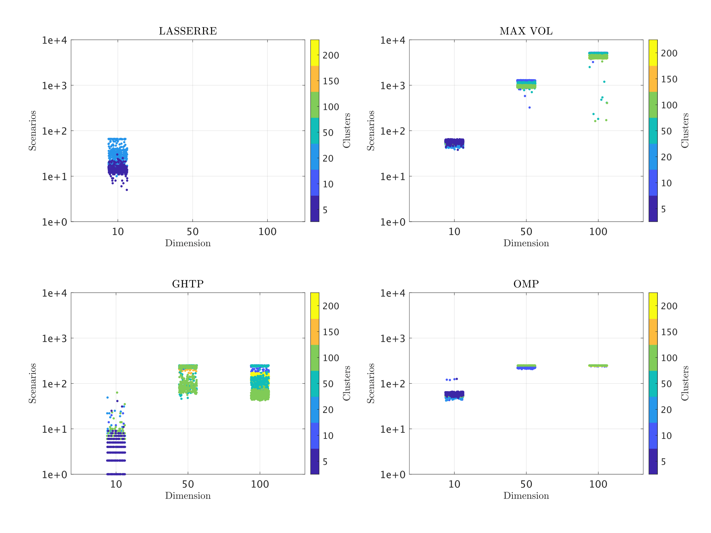

# Scenarios
**Fast empirical scenarios**

The repository contains the implementation of the Orthogonal Matching Pursuit (OMP) algorithm from the paper [Fast empirical scenarios](https://arxiv.org/abs/2307.03927). The algorithm can identify representative scenarios from the empirical moments of large samples of multi-dimensional data. These scenarios also serve to define observation-specific explanations, see [here](https://arxiv.org/abs/2404.08747) by constructing a discrete probability measure (with a relatively small support set) that can approximate the true underlying data-generating process. Tests include identifying these scenarios for the multivariate Gaussian mixture distribution,

and benchmarking against other algorithms in the literature with regard to the relative errors, the computation times, as well as the number of scenarios,

  
   
  

and also a practical example of a non-smooth portfolio optimization problem (involving expected shortfall constraints). 

The study has been completed with the support of the SNF Grant Scenarios, under the supervision of [Paul Schneider](https://sites.google.com/view/paul-schneider) and [Michael Multerer](https://muchip.github.io/).

**Usage**

The directory [utils](utils) contains the implementation for the OMP and the covariance scenarios and their dependencies. The directory [tests](tests) includes the tests for the multivariate Gaussian mixture models, the data for which is generated as in [data](data/data.m), and that of the portfolio optimization problem with expected shortfall constraints.
